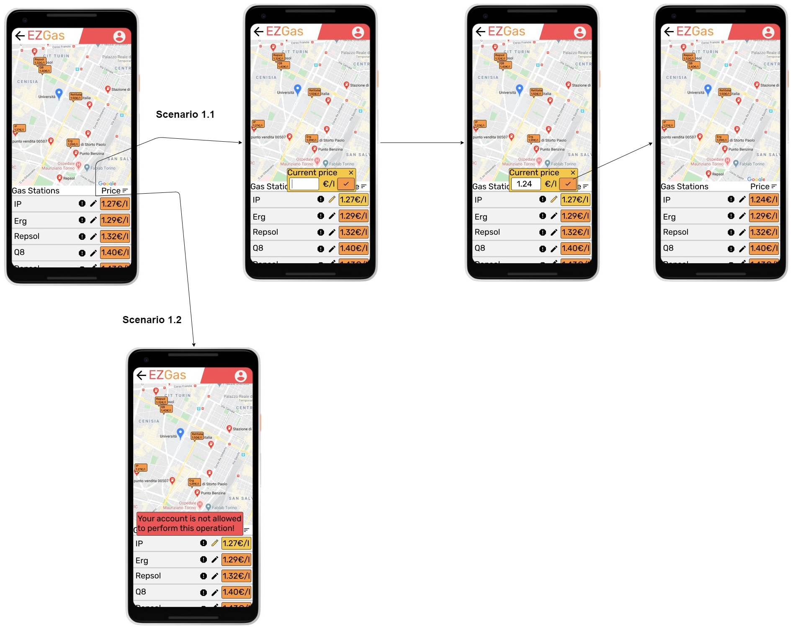
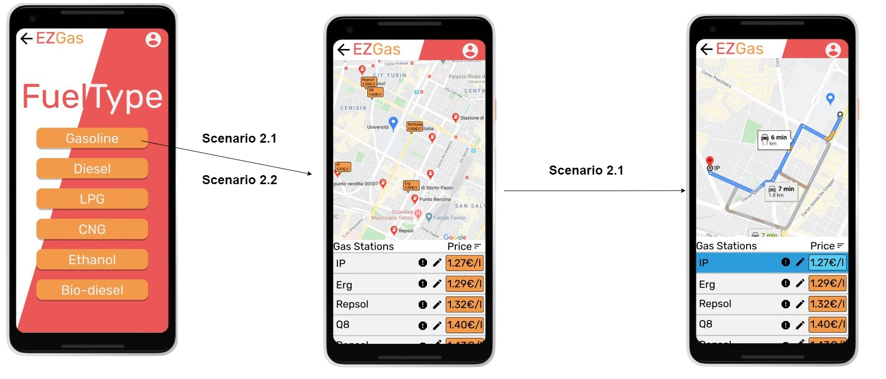
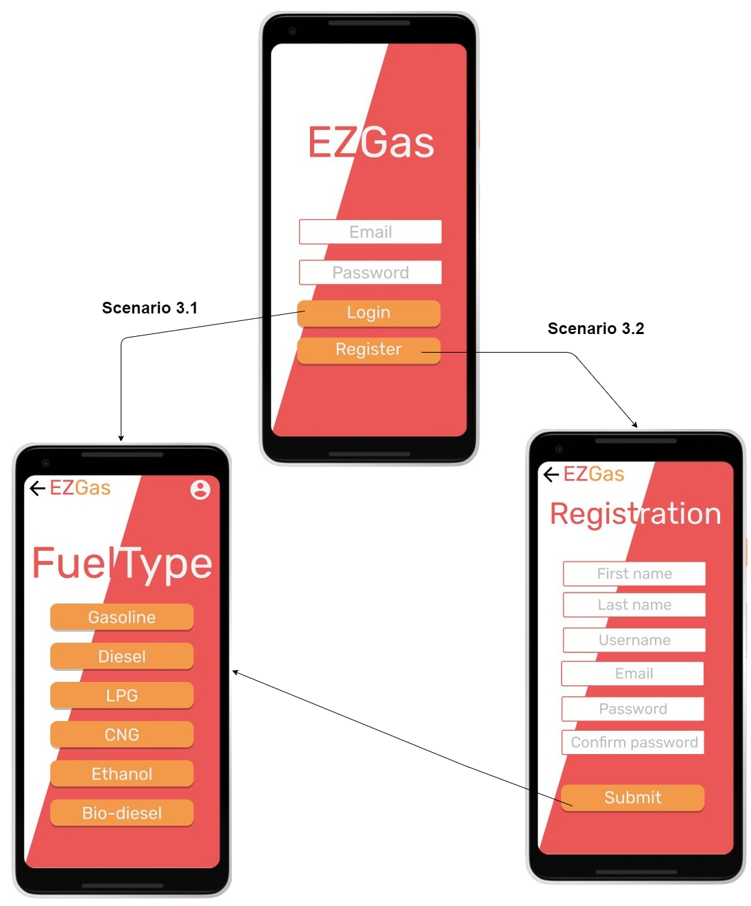
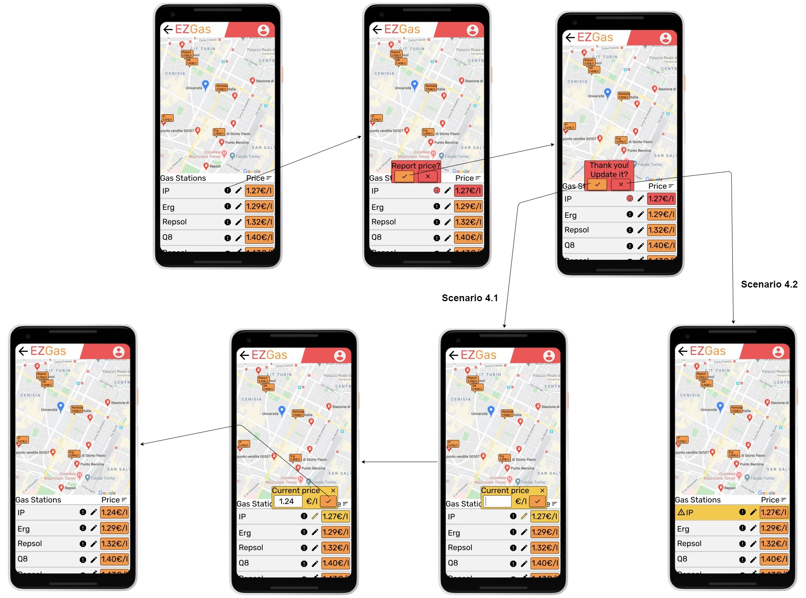
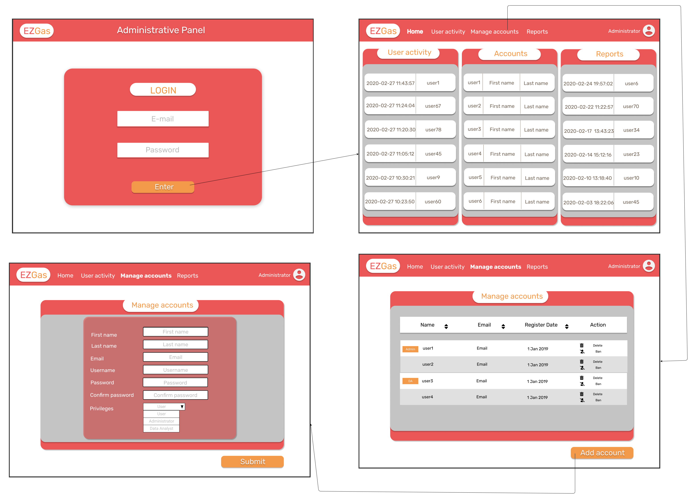
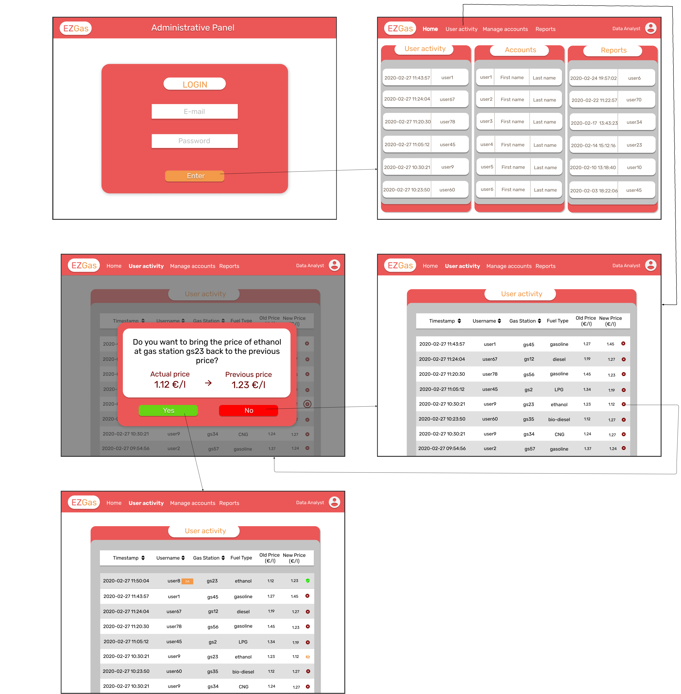
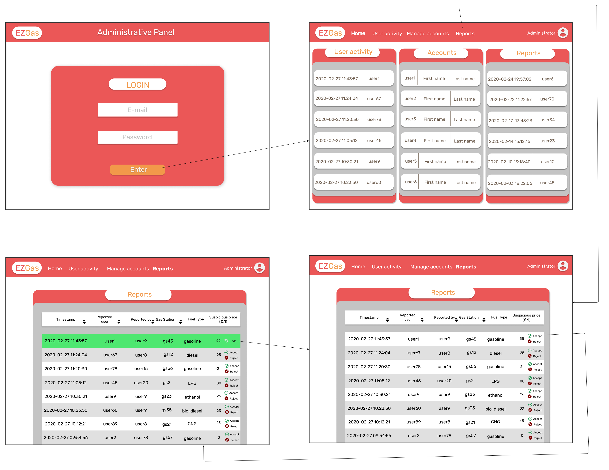
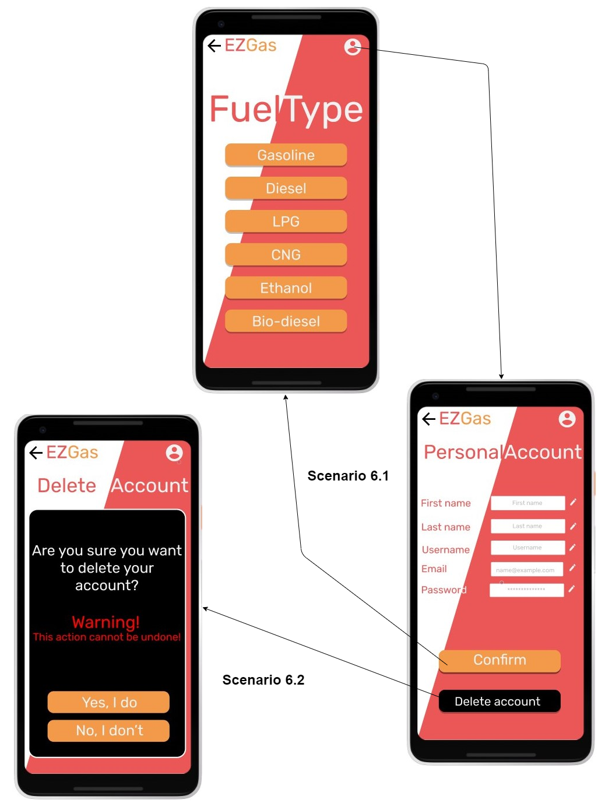

# Graphical User Interface Prototype  

Authors: Mehdi Khrichfa, Alessandro Ricciuto, Toni Saliba, Mostafa Tavassoli

Date:16/04/2020

Version:1

# Contents

- [Use case 1](#use-case-1)
    + [Scenario 1.1 and Scenario 1.2](#Scenario-1.1-and-Scenario-1.2)
- [Use case 2](#use-case-2)
    + [Scenario 2.1 and Scenario 2.2](#Scenario-2.1-and-Scenario-2.2)
- [Use case 3](#use-case-3)
    + [Scenario 3.1 and Scenario 3.2](#Scenario-3.1-and-Scenario-3.2)
- [Use case 4](#use-case-4)
    + [Scenario 4.1 and Scenario 4.2](#Scenario-4.1-and-Scenario-4.2)
- [Use case 5](#use-case-5)
    + [Scenario 5.1](#Scenario-5.1)
    + [Scenario 5.2](#Scenario-5.2)
    + [Scenario 5.3](#Scenario-5.3)
- [Use case 6](#use-case-6)
    + [Scenario 6.1 and Scenario 6.2](#Scenario-6.1-and-Scenario-6.2)

# Use case 1
## UC1 - FR1  Record fuel prices for a given gas station 
### Scenario 1.1 and Scenario 1.2
 
[Go to requirements for Scenario 1.1](./RequirementsDocument.md#Scenario-1.1) 
[Go to requirements for Scenario 1.2](./RequirementsDocument.md#Scenario-1.2)

# Use case 2
## UC2 - FR2 Check prices of fuel in various gas stations
### Scenario 2.1 and Scenario 2.2
 
[Go to requirements for Scenario 2.1](./RequirementsDocument.md#Scenario-2.1) 
[Go to requirements for Scenario 2.2](./RequirementsDocument.md#Scenario-2.2)

# Use case 3
## UC3 - FR3 Authorize and authenticate
### Scenario 3.1 and Scenario 3.2 
 
[Go to requirements for Scenario 3.1](./RequirementsDocument.md#Scenario-3.1) 
[Go to requirements for Scenario 3.2](./RequirementsDocument.md#Scenario-3.2)

# Use case 4
## UC4 - FR4 Report inaccurate fuel prices
### Scenario 4.1 and Scenario 4.2 
 
[Go to requirements for Scenario 4.1](./RequirementsDocument.md#Scenario-4.1) 
[Go to requirements for Scenario 4.2](./RequirementsDocument.md#Scenario-4.2)

# Use case 5
## UC5 - FR5 Manage users and data
### Scenario 5.1
 
[Go to requirements for Scenario 5.1.](./RequirementsDocument.md#Scenario-5.1)

### Scenario 5.2
 
[Go to requirements for Scenario 5.2](./RequirementsDocument.md#Scenario-5.2)

### Scenario 5.3
 
[Go to requirements for Scenario 5.3](./RequirementsDocument.md#Scenario-5.3)

# Use case 6
## UC6 - FR6 Manage personal account
### Scenario 6.1 and Scenario 6.2
 
[Go to requirements for Scenario 6.1](./RequirementsDocument.md#Scenario-6.1) 
[Go to requirements for Scenario 6.2](./RequirementsDocument.md#Scenario-6.2)

